# "우리의 특별한 순간들" Momentours -FrontEnd
| 커플을 위한 가장 완벽한 기록 서비스

## 🤝TEAM
| ||||| |
| :------------------------------------: | :-------------------------------------: | :-----------------------------------: | :--------------------------------------: | :-----------------------------------: | :------------------------------------------: |
| [🦖최해관](https://github.com/Haegwan-Choe) | [🐰유혜진](https://github.com/yuhyejin) | [😇장민근](https://github.com/caolian2003) | [👀이우진](https://github.com/Vorschlag-bit) | [😺김동혁](https://github.com/dongkh9) | [🐶김정모](https://github.com/mojeeeeong) |

## 기술스택

## 협업 툴

## 전체 프로젝트 일정
**프로젝트 일정 : 2024년 월 일 ~ 2024년 09월 30일**

### 목차

- [1. 프로젝트 개요](#1-프로젝트-개요)
- [2. 기능 명세서](#3-기능-명세서)
- [3. 와이어프레임](#4-와이어프레임)
- [4. 스토리보드](#5-스토리보드)
- [5. 테스트](#6-테스트)
- [6. 팀 회고](#7-팀-회고)

---

## 1. 프로젝트 개요
| 연인과의 소중한 추억을 기록하고, 여러분만의 데이트 코스를 공유하고 추천받는 웹 서비스 입니다.

### 1.1 프로젝트 소개

**소중한 연인과의 기억을 간직하고 다양한 데이트 코스를 알아보세요**

✔️ 우리의 소중한 기억을 지도 위에 기록하세요

✔️ 다른 커플은 어디서 어떻게 놀까?

✔️ 맛집, 카페, 액티비티 등 취향에 맞는 데이트 코스

---

## 2. 기능 명세서

---

## 3. 와이어프레임

  
회원

   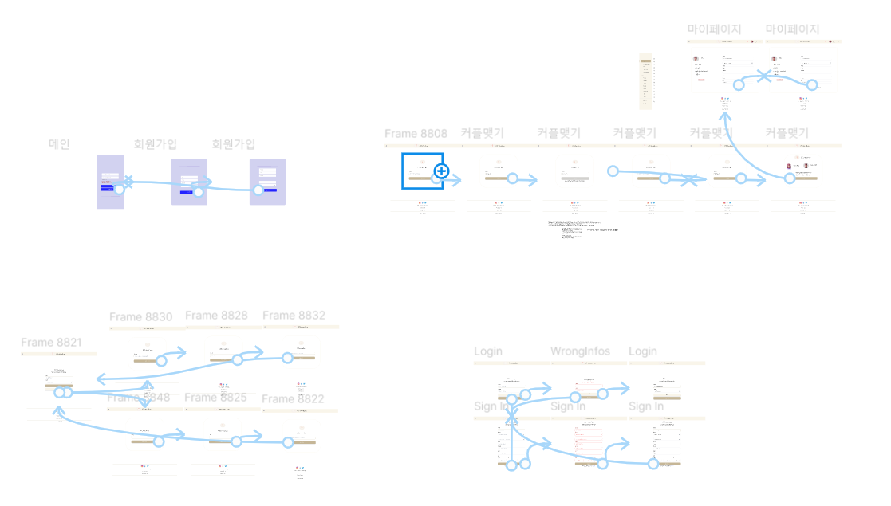

  
커플

  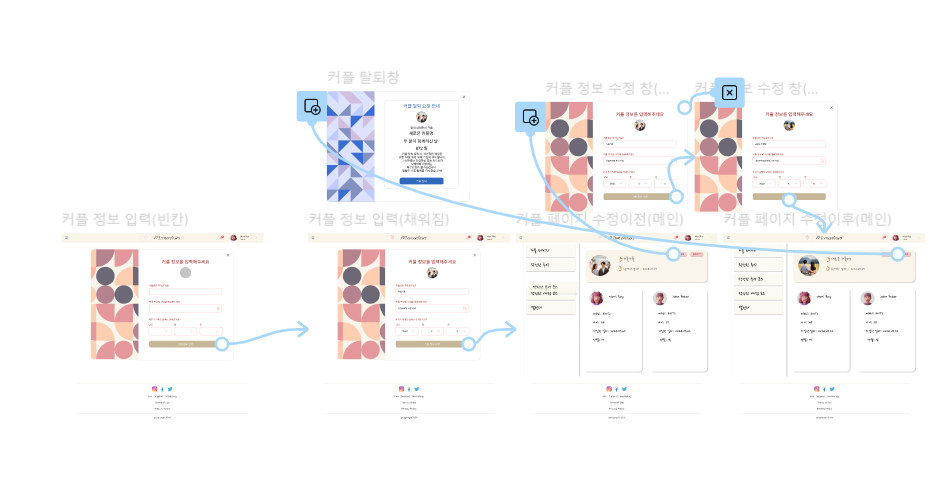

  
추억

  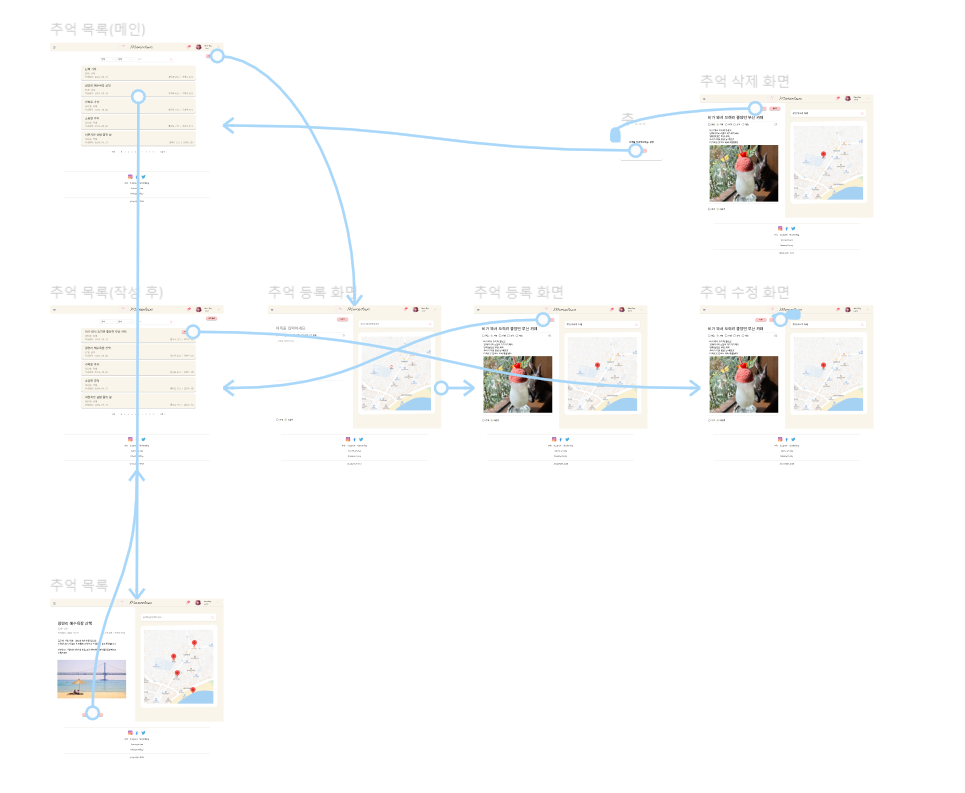

  
추억코스

  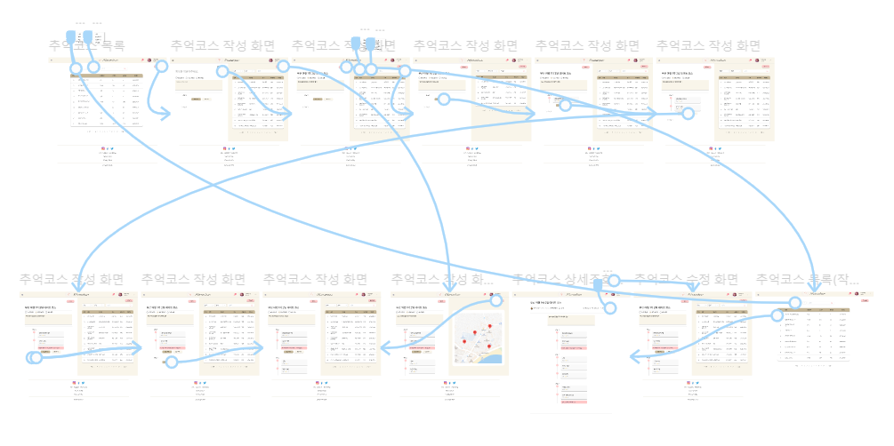

  
예정코스

  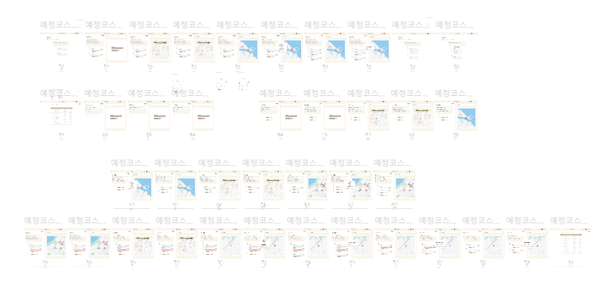

  
랜덤질문

  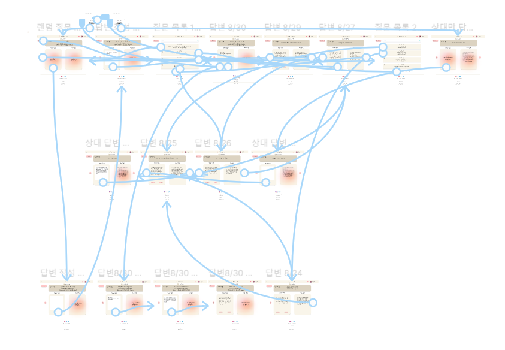

  
일기

  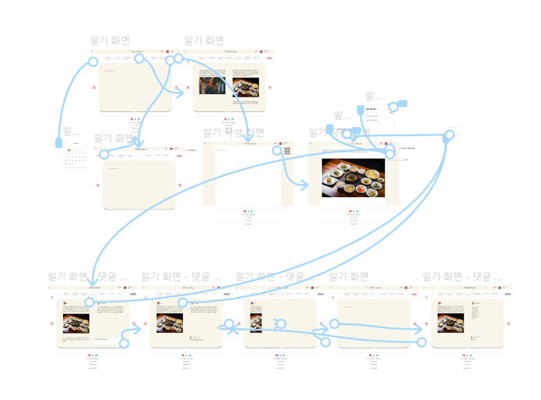

  
일정

  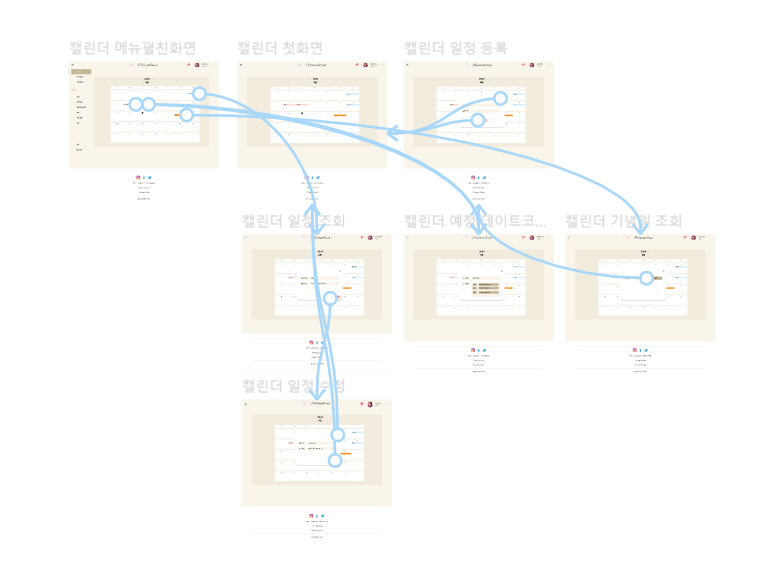

---

## 4. 스토리보드

  
회원

  
커플

  
추억

  
추억코스

  
예정코스

  
랜덤질문

  
일기

  
일정

  
  - 

      
일정조회

    
      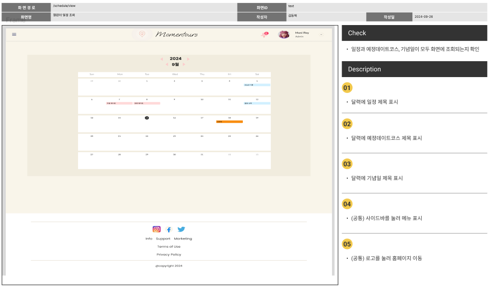
    
    

  
  - 

      
일정상세조회

    
      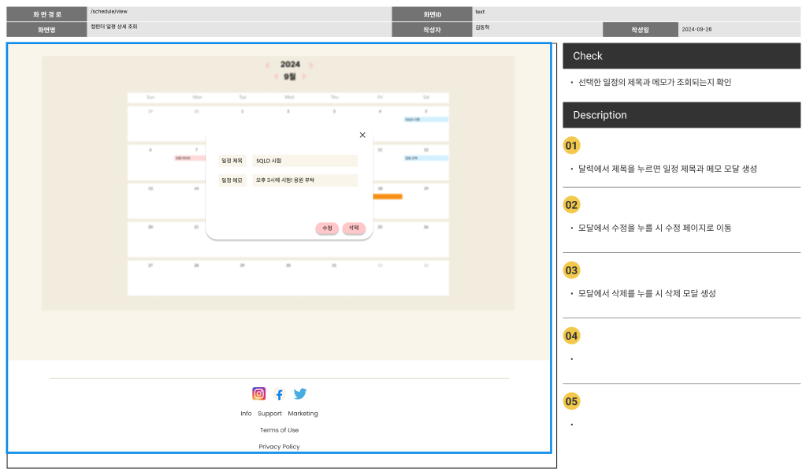
    
    

  - 

      
일정작성

    
      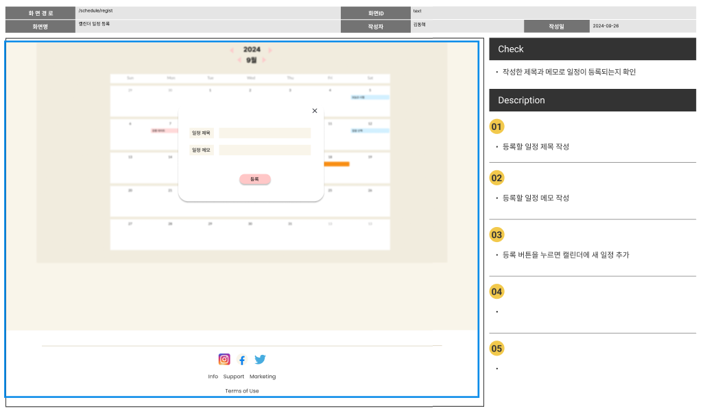
    
    

  - 

      
일정수정

    
      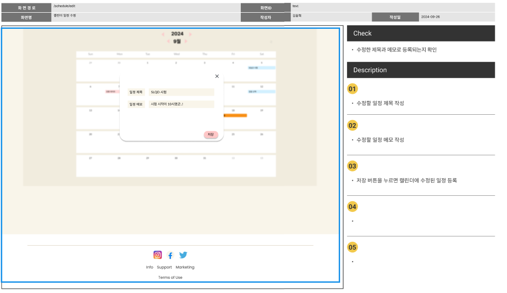
    
    

  - 

      
일정삭제

    
      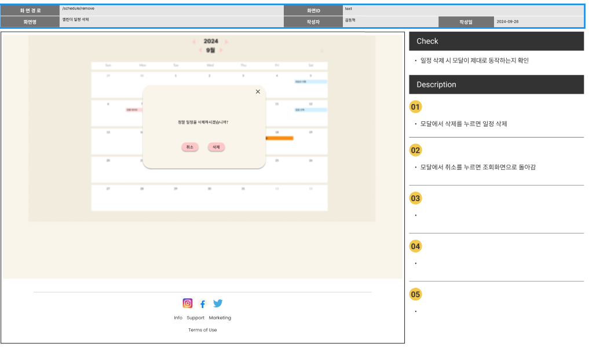
    
    

  

---

## 5. 테스트

  
회원

  
커플

  
추억

  
추억코스

  
예정코스

  
랜덤질문

  
일기

  
일정

---

## 6. 팀 회고
#### 최해관
> **유혜진**: 
> 

> **김정모**: 
> 

> **김동혁**: 
> 

> **장민근**: 
> 
> **이우진**: 
> 

#### 유혜진
> **최해관**: 
> 
> **김정모**: 
> 

> **김동혁**: 
> 
> **장민근**: 
>

> **이우진**: 
> 
#### 김정모
> **최해관**: 
> 

> **유혜진**: 
> 

> **김동혁**: 
>

> **장민근**: 
> 
> **이우진**: 
> 

#### 김동혁
> **최해관**: 
> 

> **유혜진**: 
>

> **김정모**: 
>

> **장민근**: 
>

> **이우진**: 
> 

#### 장민근
> **최해관**: 
> 

> **유혜진**: 
> 

> **김정모**: 
> 

> **김동혁**: 
> 

> **이우진**: 
> 

#### 이우진
> **최해관**: 
> 
> **유혜진**: 
> 

> **김정모**: 
>

> **김동혁**: 
>

> **장민근**:
> 

