# "우리의 특별한 순간들" Momentours -FrontEnd
| 커플을 위한 가장 완벽한 기록 서비스

## 🤝TEAM
| ||||| |
| :------------------------------------: | :-------------------------------------: | :-----------------------------------: | :--------------------------------------: | :-----------------------------------: | :------------------------------------------: |
| [🦖최해관](https://github.com/Haegwan-Choe) | [🐰유혜진](https://github.com/yuhyejin) | [😇장민근](https://github.com/caolian2003) | [👀이우진](https://github.com/Vorschlag-bit) | [😺김동혁](https://github.com/dongkh9) | [🐶김정모](https://github.com/mojeeeeong) |

## 기술스택

## 협업 툴

## 전체 프로젝트 일정
**프로젝트 일정 : 2024년 9월 23일 ~ 2024년 09월 30일**

### 목차

- [1. 프로젝트 개요](#1-프로젝트-개요)
- [2. 기능 명세서](#3-기능-명세서)
- [3. 와이어프레임](#4-와이어프레임)
- [4. 스토리보드](#5-스토리보드)
- [5. 테스트](#6-테스트)
- [6. 팀 회고](#7-팀-회고)

---

## 1. 프로젝트 개요
| 연인과의 소중한 추억을 기록하고, 여러분만의 데이트 코스를 공유하고 추천받는 웹 서비스 입니다.

### 1.1 프로젝트 소개

**소중한 연인과의 기억을 간직하고 다양한 데이트 코스를 알아보세요**

✔️ 우리의 소중한 기억을 지도 위에 기록하세요

✔️ 다른 커플은 어디서 어떻게 놀까?

✔️ 맛집, 카페, 액티비티 등 취향에 맞는 데이트 코스

---

## 2. 기능 명세서

   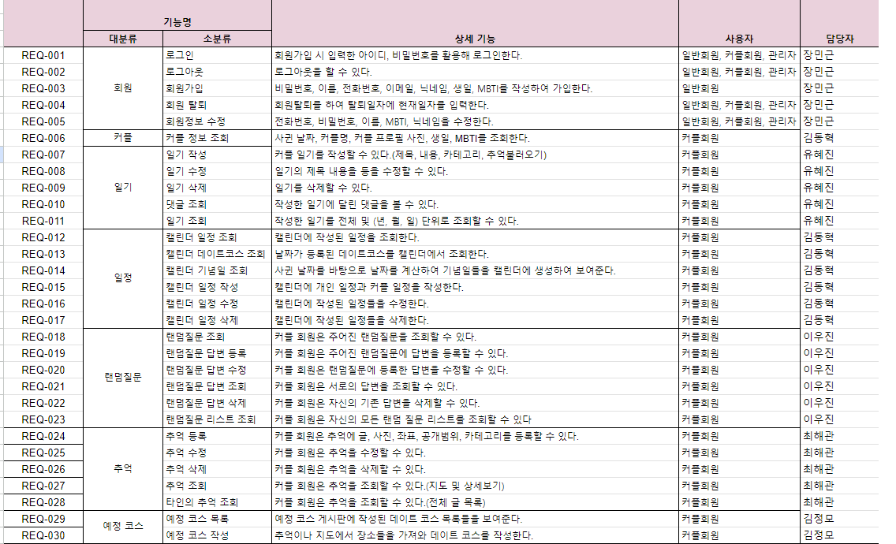

---

## 3. 와이어프레임

  
회원

   

  
커플

  

  
추억

  

  
추억코스

  

  
예정코스

  

  
랜덤질문

  

  
일기

  

  
일정

  

---

## 4. 스토리보드

  
회원

  
커플

  
추억

  
추억코스

  
예정코스

  
랜덤질문

  
일기

  
일정

  
  - 

      
일정조회

    
      
    
    

  
  - 

      
일정상세조회

    
      
    
    

  - 

      
일정작성

    
      
    
    

  - 

      
일정수정

    
      
    
    

  - 

      
일정삭제

    
      
    
    

  

---

## 5. 테스트

### 테스트 계획서

 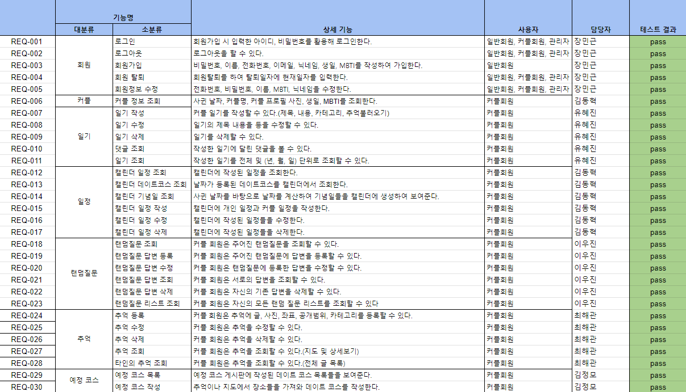

  
회원

  - 

      
회원가입

     
      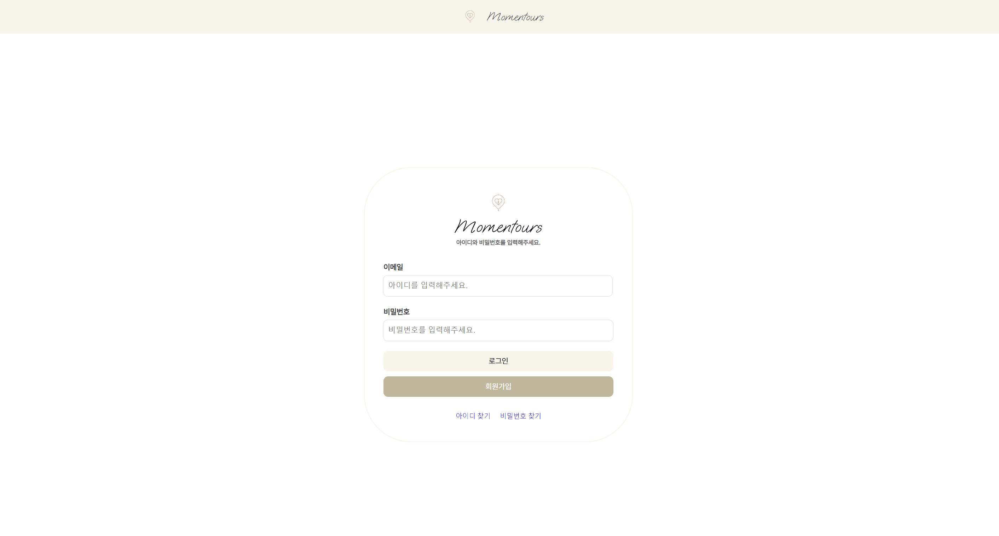
    

  - 

      
로그인

     
      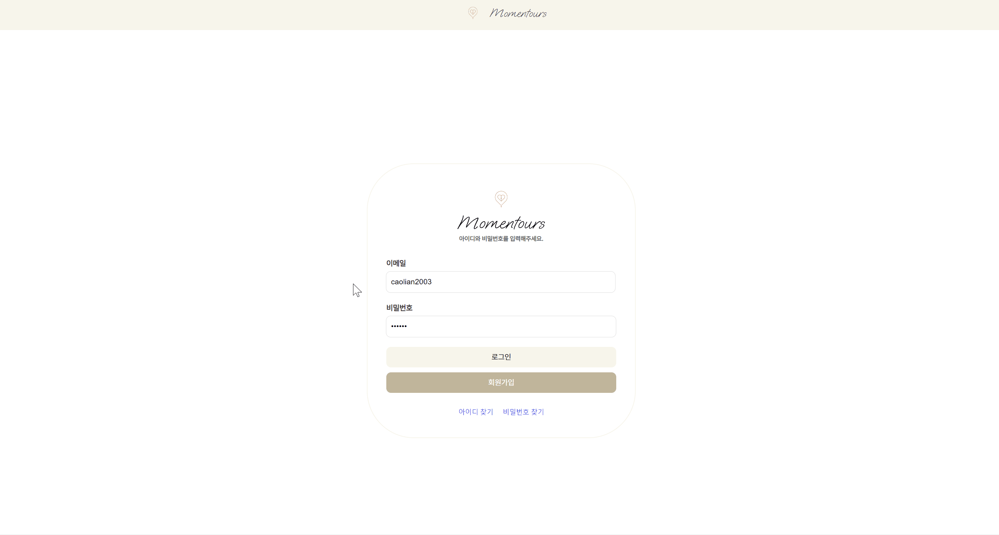
    

  - 

      
개인정보 수정

     
      
    

  
커플

   - 

      
커플페이지조회

      
        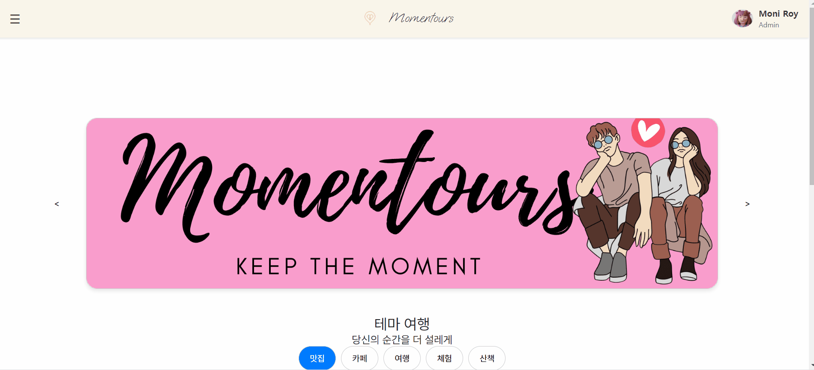
      
       

  
추억

  
추억등록

  

  
추억수정

  

  
추억삭제

  
  
  
  

  

  
추억 상세 조회

    
  
  
  

  
지도 검색 기능

    
  
  
  

  

  
예정데이트코스

     
  - 

      
예정데이트코스목록조회

    
      
    
    

      
  - 

      
예정데이트코스작성

    
      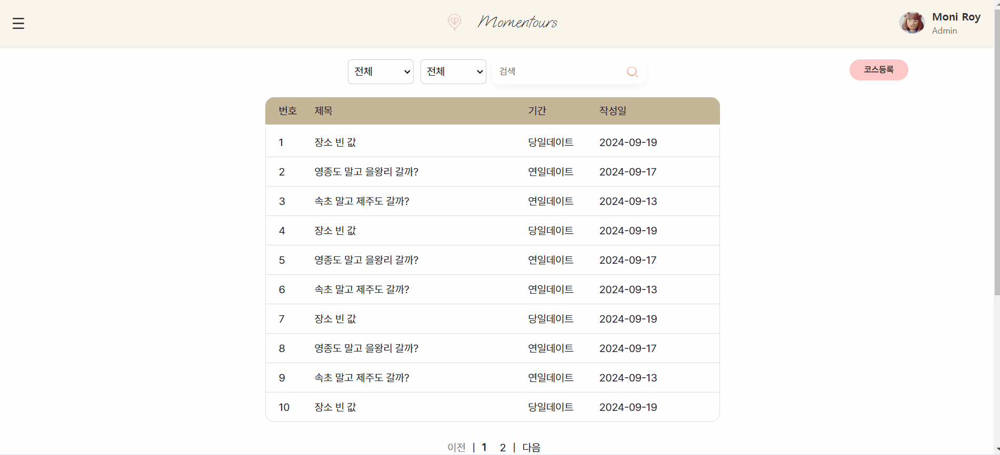
    
    

  
랜덤질문

  

    
1.랜덤질문 메인화면

  

  

  

    
2.랜덤질문 답변작성

  

  

  

    
2.랜덤질문 답변수정

  

  

  

    
3.랜덤질문 답변삭제

  

  

  

    
4.랜덤질문 페이지네이션

  

  

  

    
5.랜덤질문 전체리스트 조회

  

  

  

    
6.랜덤질문 리스트 상세조회

  

  

  
일기

  - 

      
일기조회

    
      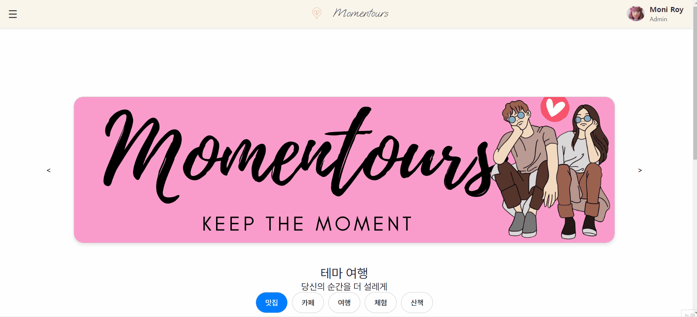
    

  - 

      
일기등록

    
      
    

  - 

      
일기수정

    
      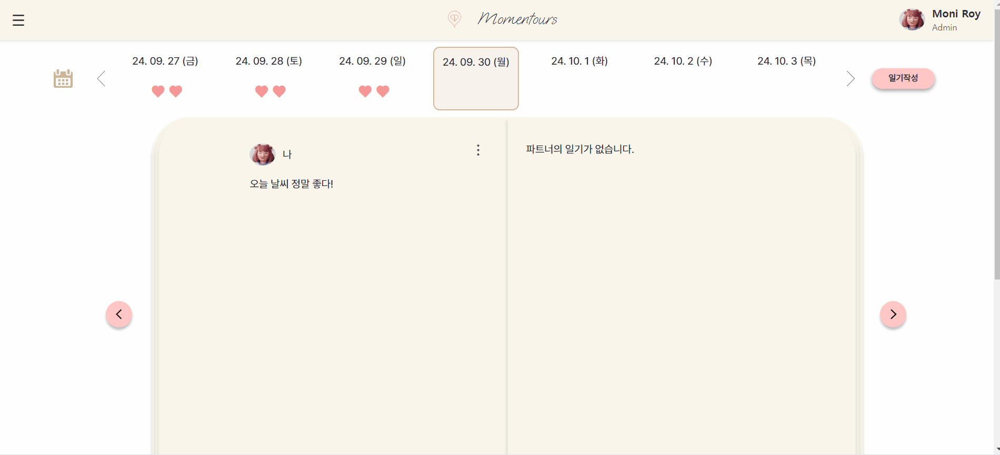
    

  - 

      
일기삭제

    
      
    
    

  
일정

  
  - 

      
일정조회

    
      
    
    

  
  - 

      
일정수정

    
      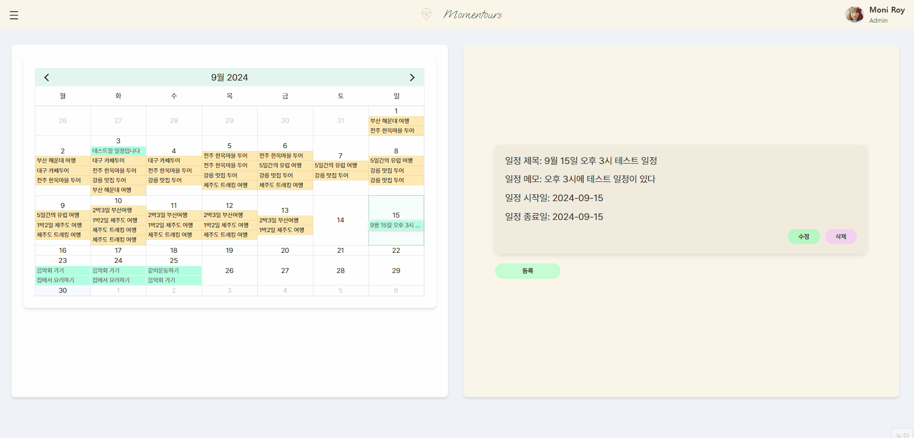
    
    

  - 

      
일정작성

    
      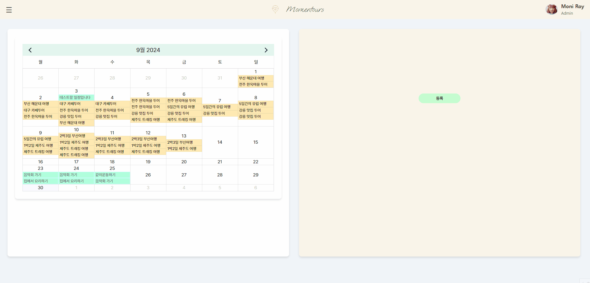
    
    

  - 

      
일정삭제

    
      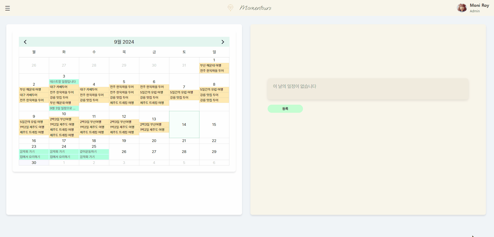
    
    

---

## 6. 팀 회고
#### 최해관
> **유혜진**: 척척박사 해관쓰! 백엔드와 프론트 프로젝트 기간 동안 함께 할 수 있어서 너무너무 재밌었습니다! 침대에서 누워서 코딩할 정도로 의지가 대단한 친구랍니다! 이번에 지도 API도 잘 연동하고 마지막까지 Json server 연동 끝내서 좋았습니다! 
> 

> **김정모**: 
> 

> **김동혁**: 
> 가장 어려운 부분인 지도 api 활용을 맡아 프론트 프로젝트 기간 내내 너무 고생해서 감사하다는 인사 드리고 싶습니다. 프론트 프로젝트에서의 핵심을 잘 맡아줘서 프로젝트가 잘 마무리 된 것 같습니다.

> **장민근**: 프론트앤드 프로젝트중 구현 난이도가 높았던 캘린더 및 지도 api 중 지도 api를 담당한 훌륭한 팀원이다. 기존에 React 기반 프로젝트를 진행했던 경험이 있어 자잘한 트러블슈팅에 지속적으로 도움을 주어 팀원 모두가 프로젝트 시 한결 더 수월하게 진행할 수 있었다 생각한다.
> 
> **이우진**: 프론트 엔드에서 가장 어려운 지도 api를 이용한 json 서버 통신을 담당했었습니다. Json 서버와 통신의 한계가 있음에도 훌륭하게 구현을 성공해냈으며 프론트엔드를 먼저 경험해본 경험으로 팀원들에게 vue의 흐름에 대해서 설명해줘서 프로젝트 시작속도를 앞당겼습니다.
> 

#### 유혜진
> **최해관**: 프로젝트 세팅의 대가. 항상 프로젝트에 앞서서 다양한 라이브러리들을 앞장서서 찾아와 주셨습니다. 덕분에 여러 라이브러리 편하게 써서 개발할 수 있었어요!
> 
> **김정모**: 정말 정말 맘고생 많이 했던 정모님!! 어렵다 어렵다 하지만 그래도 열심히 하려고 노력하고 만들어내서 정말 멋져요!! 긴 프로젝트였지만 실 프로젝트 기간을 적어서 허둥거리면서 했지만 앞으로 남은 두 프로젝트에서는 이번 프로젝트를 기점으로 더 잘할 수 있을 거예요! 아자아자 정말 고생했습니다! 
> 

> **김동혁**: 
> 일기 도메인을 맡아 피그마에서 구상한대로 화면 구현을 매우 잘해주셔서 프로젝트의 디테일이 잘 살아난 것 같습니다.
> 
> **장민근**: 이우진 팀원과 마찬가지로 공통 컴포넌트 개발 및 프로젝트 파일 세팅을 담당한 팀원이다. 프로젝트를 진행할 떄 마다 훌륭한 실력을 갖췄음에도 자신을 낮추는 겸손 또한 가지고 있다. 동혁님 처럼 트러블슈팅 능력 또한 겸비하였고, 한 번 일을 시작하면 밤을 지새워서까지도 끝까지 책임지려는 예비 개발자로써 아주 훌륭한 태도를 갖고 있다. 
>

> **이우진**: 백엔드때도 마찬가지지만, 프론트 엔드의 흐름을 빠르게 이해해서 팀원들을 위해 가장 먼저 프로젝트 구조를 설계했습니다. 덕분에 많은 조원들이 빠르게 프로젝트에 착수할 수 있었고, 맡은 도메인이 정말 구현 난이도가 높았음에도 전공자답게 끝내 json 서버와 통신을 하면서 프로젝트의 완성도를 높였습니다!
> 
#### 김정모
> **최해관**: 항상 새벽까지 노력하는 형의 모습을 보면 저절로 학구열에 불이 붙습니다. 이번 프로젝트의 원동력은 디스코드에 항상 온라인으로 떠 있던 형님이었습니다!
> 

> **유혜진**: 
> 

> **김동혁**: 
> 지도 api를 활용하는 추억코스 도메인을 맡아 해관님과 함께 프로젝트 기간동안 너무 고생한 모습이 보였습니다. 덕분에 프로젝트의 핵심 기능인 지도 api 구현이 성공적으로 마무리되었습니다. 끈기를 칭찬하고 싶습니다.

> **장민근**: 비전공자이지만 포기하지 않고 끈질기게 이해하려는 태도에 항상 놀란다.
매일 아침 누구보다도 일찍 학원에 도착하여 개인 공부를 통해 성장하고자 하는 갈망을 누구보다도 강하게 내비치고 있다. 
처음인 프론트앤드 프로젝트에 많이 헤메었지만 이 경험을 발판삼아 더욱 도약하게되는 좋은 경험이 되었으리라 생각한다.
> 
> **이우진**: Figma 구현부터 json 서버를 통해 통신 테스트를 하는 단계까지 모든 과정에 있어서 진심을 다해 임하는 모습을 보여줬습니다. 처음 배우는 프론트 엔드 과정이라 곧바로 적용하는 데에도 많은 고생을 헀지만 끝까지 포기하지 않는 모습과 어떤 역할을 맡더라도 프로젝트에 도움이 되고자 했습니다!
> 

#### 김동혁
> **최해관**: 명실상부 팀의 구원자. 모두가 막히는 문제를 앞장서서 해결해주고 코드 리뷰를 꼼꼼히 해주셔서 더 나은 프로젝트가 될 수 있었던 것 같습니다. 가장 어려운 부분들을 도맡아 하시는 모습 꼭 배우고 싶습니다!!
> 

> **유혜진**: 
>

> **김정모**: 
>

> **장민근**: 백엔드 프로젝트부터 프론트 앤드 프로젝트까지 언제나 밝게 웃으며 우리 팀의 기둥이 되어준 팀원이다. 항상 언제나 어려움이 있을 때  뛰어난 알고리즘 구현 능력으로 문제를 해결하는데 도움을 주며어려움을 극복하도록 하는데 큰 힘이 되어주었다. 또한 팀원들이 프로젝트 시 어긋난방향으로 나아갈 떄 한 번씩 맥락을 잡아주는 능력 또한 훌륭하다고 생각한다. 항상 자신의 몫을 끝내고 다른 팀원들을 도우려고 하는 점이 가장 인상깊었다.
>

> **이우진**:  json 서버 통신을 포기하지 않고  시도한 끝에 성공해서 팀원들에게 아주 큰 도움이 되었습니다. 처음 배워보는 프론트엔드 과정이었으나 vue의 흐름을 남다른 통찰력으로 빠르게 파악한 후, 같은 조원뿐만 아니라 다른 조원들에게까지 친절히 설명했습니다. 어떤 어려움이 있어도 같이 고민해주며 최선의 방법을 찾아내려고 노력하며, 어떤 역할을 맡아도 최선을 다 했습니다!
> 

#### 장민근
> **최해관**: 백엔드 프로젝트 때와 달리 더 웃는 모습을 많이 볼 수 있었습니다. 친해져서 그런 것일수도 있는데 웃는 모습으로 즐겁게 코딩하는 모습에 스트레스가 날아가는 기분이었습니다! ㅋㅋ
> 

> **유혜진**: 묵묵하게 열심히 하는 인근님! 이번에 메인 페이지 너무 잘 만들어서 좋았습니다! 프런트에 소질 있으신 거 같아요!! 백엔드부터 프론트까지 길었는데 같이 팀 하면서 너무 재밌었고 즐거웠습니다. 그동안 고생하셨고 앞으로도 승승장구하시길!!
> 

> **김정모**: 
> 

> **김동혁**: 
> 회원 도메인과 메인 페이지를 맡아 전체적인 프로젝트의 분위기를 잘 잡아주셨습니다. 덕분에 프로젝트의 큰 방향이 문제 없이 잘 흘러간 것 같습니다.

> **이우진**: 회원도메인을 맡아, 많은 컴포넌트를 구성하며 팀에 기여를 했습니다. Html 문법과 css 문법에 능통하셔서 어려움이 있을 때마다 도움이 주셨고 그 덕에 빠르게 프로젝트를 끝낼 수 있었습니다.
> 

#### 이우진
> **최해관**: 맨날 약한 척하지만 사실 고수인 형,,, 생각지도 못한 방법으로 구현하는 모습을 본 덕분에 어깨너머로 몇 가지 좀 훔쳐 배웠습니다. ㅋㅋ!! 다들 익숙치 않은 프론트 프로젝트지만 피그마를 뚝딱뚝딱 만져서 공통 컴포넌트들을 빠르게 완성해주셔서 수월했던 것 같습니다!
> 
> **유혜진**: 데이터베이스 프로젝트부터 백엔드, 프론트까지 약 3개월 동안 으쌰으쌰 하며 프로젝트를 진행해왔는데 옆에서 지켜보면서 항상 열심히 하고, 맡은 일은 꼭 끝까지 꼼꼼하게 해왔습니다. 장난도 많이 쳤는데 잘 받아주고 물어볼 때마다 잘 대답해줘서 항상 너무 고맙고 항상 잘하니까 다른 팀 가서도 더더 잘했으면 좋겠습니다!
> 

> **김정모**: 
>

> **김동혁**: 
> 랜덤질문 도메인을 맡아 다소 복잡할 수 있는 화면을 잘 구현해주셨습니다. 프로젝트의 디테일이 덕분에 살아나 더욱 완성도 높아졌다고 생각합니다.

> **장민근**:언제나 자신의 몫을 해내는 든든한 팀원이 바로 이우진 팀원을 보고 하는 말이 아닐까 생각한다. 비록 모두가 프론트앤드 프로젝트가 처음이라 많이 어려워했지만 그럼에도 불구하고 자신의 기능뿐 아니라 공통 컴포넌트 개발에도 기여하며 팀원들이 프로젝트를 수월하게 진행하도록 하는데 큰 기여를 했다.
> 

