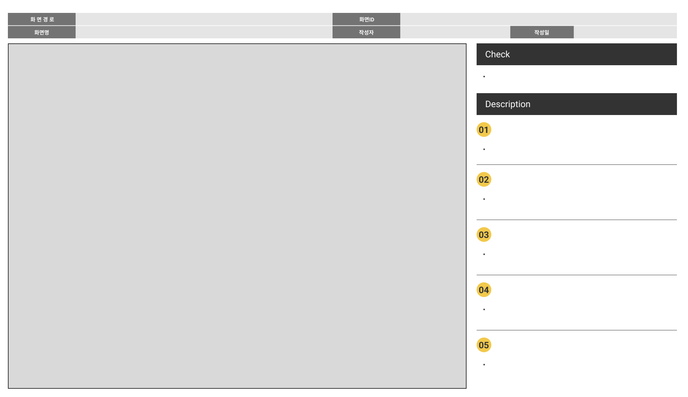

# momentours-front
momentours 프론트 레포입니당omentours 프론트 레포입니당

  
랜덤질문

  

    
1.랜덤질문 메인화면

  
  

  

    
2.랜덤질문 답변 조회

  

  

    
3.랜덤질문 답변 등록

    
  

  

    
4.랜덤질문 답변 수정

    
  

  

    
5.랜덤질문 답변 삭제

    
  

  

    
6.랜덤질문 리스트 조회

    
  

