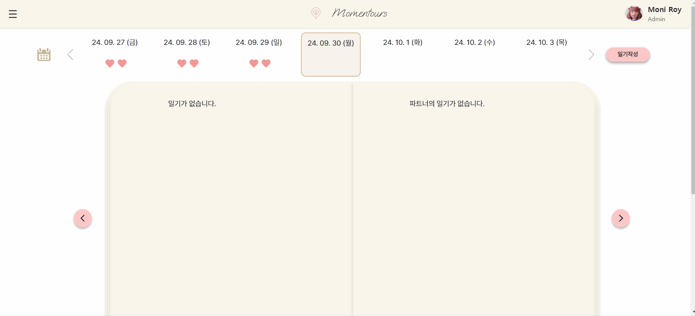
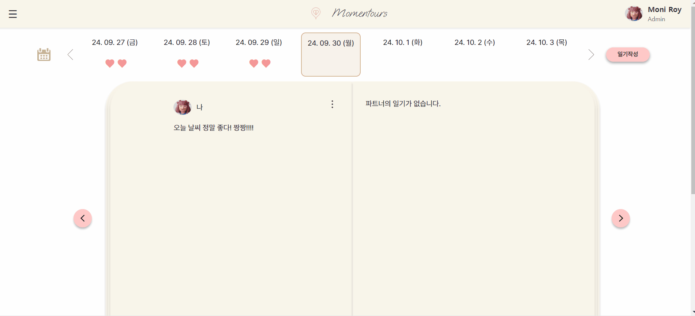

# momentours-front

  
일기

  

    
일기조회 - 일기 없는 버전

  

  

  

    
일기조회 - 일기 있는 버전

  

  

  

    
일기등록

  

  

  

    
일기수정

  

  

  

    
일기삭제

  

  

gif!!
<!-- gif -->

  
일기

  

  
일기

  

    
일기조회

  

  

  

    
일기등록

  

  

  

    
일기수정

  

  

  

    
일기삭제

  

  

